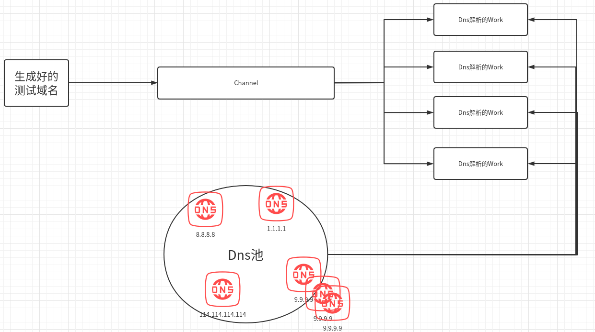
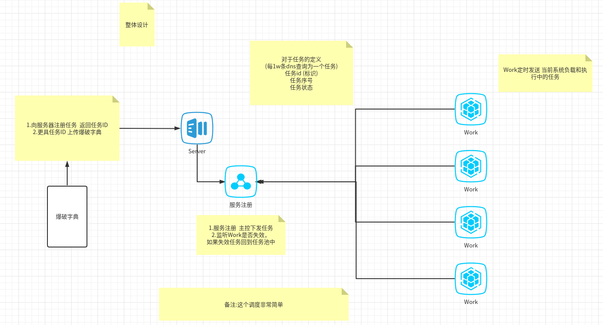
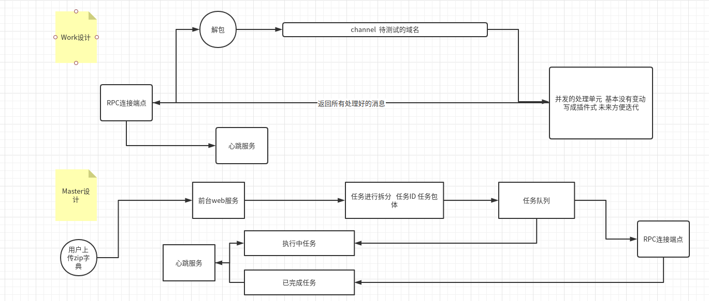
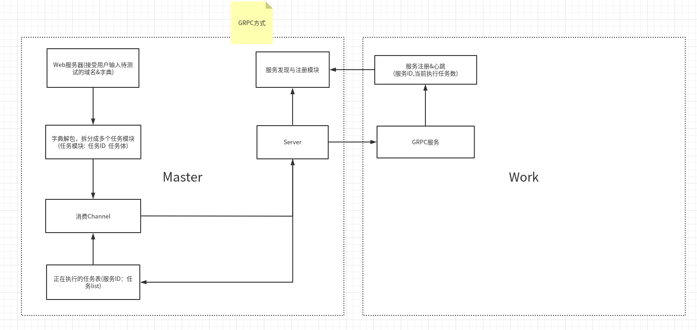

# 分布式DNS爆破系统

## 系统的由来:
红队对目标网站进行黑盒测试 面对未知站点进行DNS爆破找到子域 以得到更多突破点

传统的DNS爆破工具  慢 且 不精准

于是开始研发次系统

## 系统设计
#### 子域发现：
- 1.公开数据
    - Ask, Baidu, Bing, BuiltWith, DNSDumpster, HackerOne, RapidDNS, Riddler, SiteDossier, ViewDNS, Yahoo
    - Active pulls (optional), Censys, CertSpotter, Crtsh, FacebookCT, GoogleCT
- 2.dns爆破
在此只介绍DNS爆破相关  对公开数据的访问 无非就是爬虫

#### 难点:
- 1.dns节点访问限制

#### 解决:
针对dns单节点访问限制：
    - 1.代理
    - 2.dns pool (https://github.com/dollarkillerx/publicDns 发现全球DNS服务器)

### 系统设计

RPC框架：https://github.com/dollarkillerx/vodka