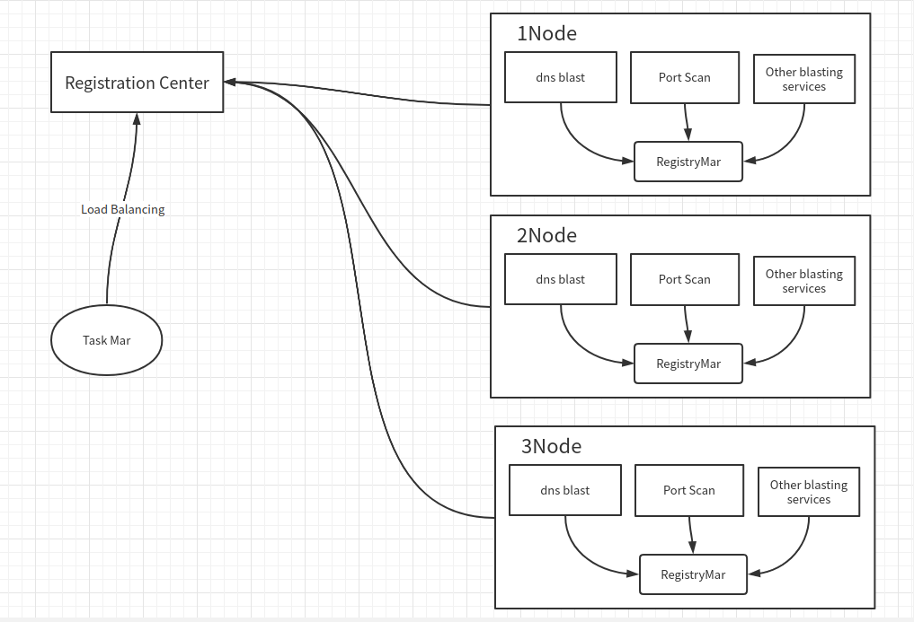

# 分布式任务系统

## 系统的由来:
网络安全公司有很多服务都需要分布式能力(子域枚举,路径枚举,端口扫描,服务识别...)，如果来一个写一个 

1. 难以管理
2. 开发效率太慢

于是想开发一个整合系统  每一个服务相当于一个插件  类似(serverless)

每加一个服务 可快速融入当前系统  利用集群加速  不必为每个服务都重头开始编写

## 系统设计

### 当前遇到的问题
- 1.如何定义一个插件 让它可以兼任所有服务
- 2.插件治理
- 3.任务调度

### 解决
- 任务调度
    - BAS总线
- 插件定义
    - 插件对Plugin 具体实现
```go
type Task struct {
	TaskID   string // 任务ID
	TaskBody []byte // json 不同plugin 处理JSON结构不一
}

type Plugin interface {
	Register() string           // 返回当前插件名称
	Assignment(task Task) error // 下发任务
}
```
- 插件治理
    - 针对Bus下发不同任务 获取插件中心不同任务对象执行
```go
type RegistryMar struct {
	persistence map[string]Plugin
	mu          sync.Mutex
}

func New() *RegistryMar {
	return &RegistryMar{persistence: map[string]Plugin{}}
}

// 插件注册
func (r *RegistryMar) Registry(key string, plugin Plugin) {
	r.mu.Lock()
	defer r.mu.Unlock()

	r.persistence[key] = plugin
}

// 初始化插件
func (r *RegistryMar) GetPlugin(key string) (plugin Plugin, err error) {
	r.mu.Lock()
	defer r.mu.Unlock()

	plugin, ex := r.persistence[key]
	if !ex {
		return nil, fmt.Errorf("plugin not found")
	}
	return plugin, nil
}
```

### 系统设计


