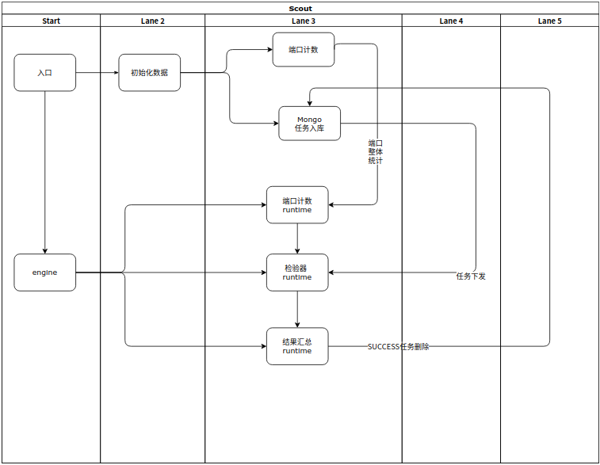

# 分布式端口扫描系统

## 系统的由来 
都有了任务系统为什么还要多一个分布式端口扫描系统？

这个比较特殊  为网络空间测绘的一部分

#### 什么是网络空间测绘
将虚拟网络空间与现实物理世界相关联，绘制网络空间多维立体地图

物理地图一样 扫描全球网络  更具地区 国家 设备为纬度 网络战战地地图

### 难点
- 像 masscan 这类扫描软件 通过SYN扫描 以达到以极致速度扫描全球网络
    - 缺点 
        - 1.掉包
        - 2.数据极其不准确

### 解决 
- 采用传统的扫描 以达到高准确性
- 采用分布式 以提高效率

### 设计 单机
单机采用分层设计  
- 1.数据发生层
- 2.扫描层
- 3.汇总层

### 分布式化
这个很简单  就没有什么说的了  