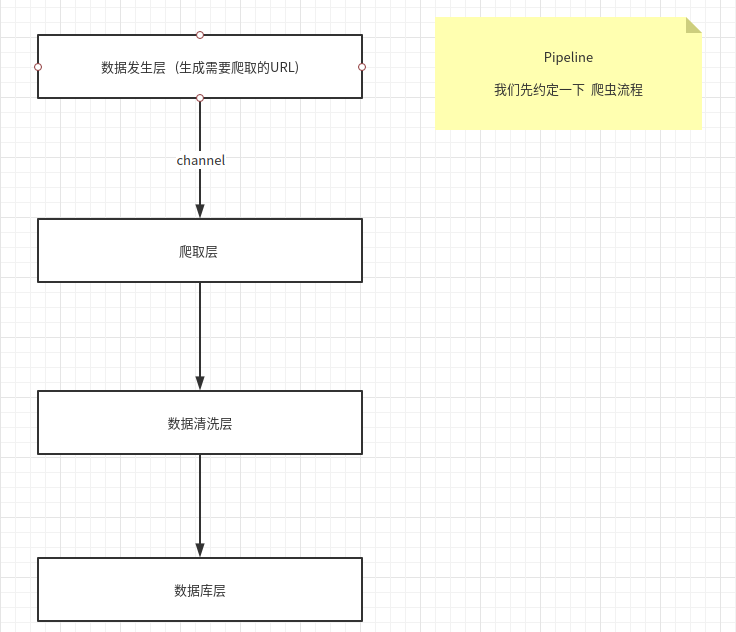
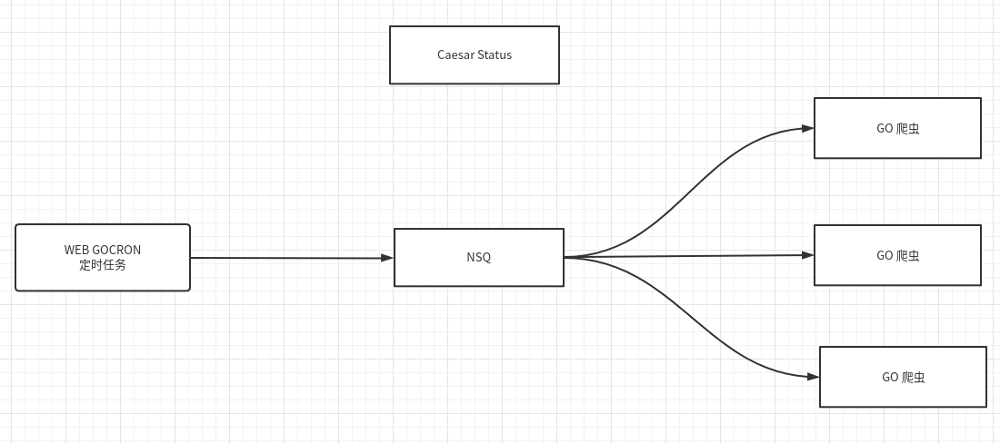
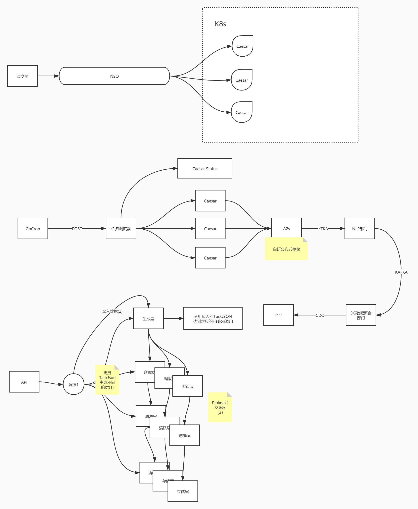

# 分布式爬虫

## 为何而生
来到一个新公司做金融数据的  

需要挖掘新闻数据 , 聚合新闻, 新闻和数据库公司实体关联 和 一些投资信息补充

这边要写一个爬虫框架  于是我主导了开发

## 设计
爬虫约定

我们对爬取动作进行分层
- 1.数据发生层  产生详情页URL  
    - 更具新闻首页 获取 分页数据
    - 通过分页数据解析出详情页URL
    - 放入channel
- 2.爬取层
    - 读取channel 放入爬虫池中并发爬取 
    - 放入下级channel
- 3.数据清洗层
    - 简单对页面进行加工
    - 放入下级channel
- 4.数据库层
    - 入库

这就是一个单体爬虫

### 难点
- 不同的新闻网站 数据发生层不同 (因为网站样式不同)

### 解决
- 对每一个层进行抽象 定义不同的插件 
    - 36k 插件
    - 虎岫 插件

### 分布式化

### 数据联动
